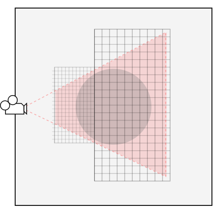

# UnityToon

## 1. outline

**实现方式**：1.所有点的scale增大；2.所有点向法线方向迁移一定距离，迁移程度在inspector中设定。第二种方式效果更自然。

**颜色**：inspector中设定的color和texture color相乘。不想有outline的地方比如面部，把inpector中的color设置成黑色，scale设置很小(i.e. 0.02)

zOverdraw: 不同深度，从后往前，多次渲染叠加；

## 2. BasicLit

静态合批：创建新的合并网格 --》增加内存

动态合批：将可以参与合批单位的顶点属性，连续填充到一块顶点和索引缓冲区中，让GPU认为它们是一个整体。

GPU实例化：CPU调用GPU告知渲染多个实例，并传递顶点属性到顶点和索引缓冲区中，Drawcall一次，连续绘制n个。

### 2.1 vert

shadowCast

URP主灯实时阴影：分屏幕空间阴影和其他阴影2条路径；是否采用屏幕空间阴影取决于是否开启了阴影级联以及设备性能。

* 阴影级联：shadowMap按照摄像头视锥体进行采样，导致距离摄像头较近的部分采样数少，对这部分像素使用相同分辨率但尺寸缩小的shadowMap。相比使用高分辨率ShadowMap内存和带宽消耗都更小。
* 

屏幕空间阴影开销高：GLES设备不使用，通过屏幕空间坐标和depth获得CascadeShadowMap。

获取shadow map：

`ShadowSamplingData shadowSamplingData = GetMainLightShadowSamplingData();`

Raytraced hard shadow：unity内置，shadowRaytracer attached to the camera. 使用raytracedShadowMap

### 2.2 frag

Trans Clipping Mode: 使用Clipping mask 或alpha通道作为蒙版，可以用于优化头发，切割长而直的头发的末端 

doubleShadeWithFeather：2阶段shade，每次shade由shadeMap，shadeColor，shadePosition共同实现。

shadingGradeMap：使用grade map对不同区域进行不同程度的着色，实现与doubleShade类似的效果。